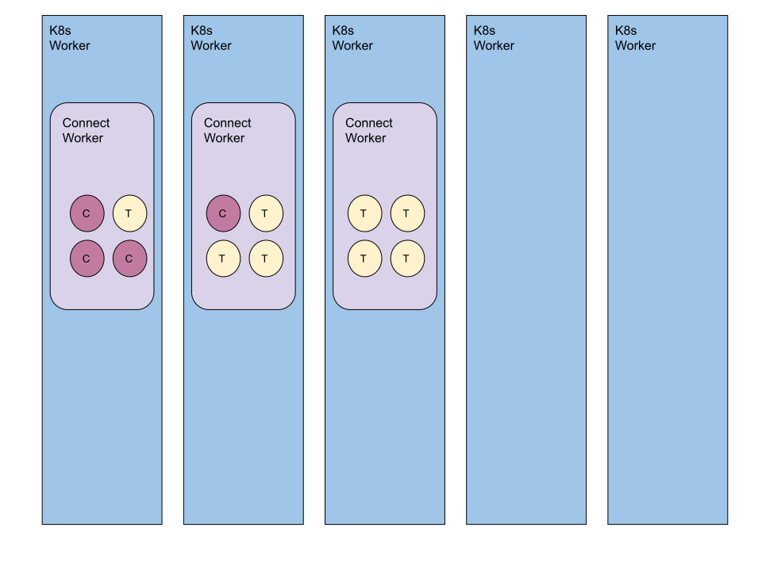
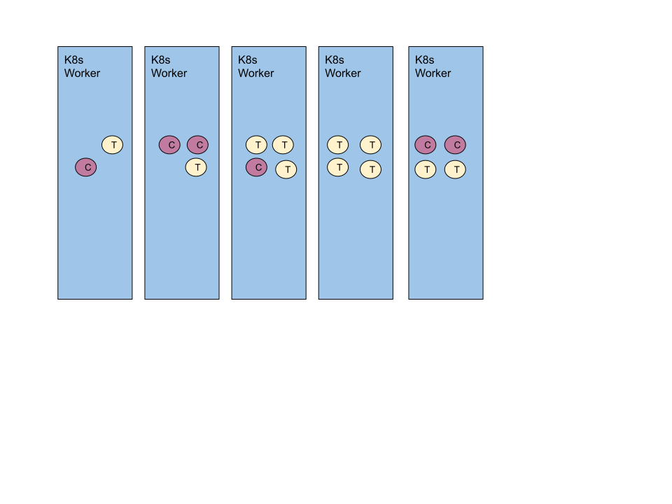

# Introduction

The goal of this project is to run Kafka Connect in a more cloud native approach. Instead of using 
Kafka Connect worker nodes we will use Kubernetes as the scheduler. Each connector and corresponding tasks
will be isolated in their own pod. This should allow for a better scheduling experience.

## Current Connect Architecture

Connect is scaled by increasing the number of workers that are part of a cluster. This means to add more capacity
a new server is launched and connectors could be scheduled there. Scheduling is inefficient because the location
of a connector or task is based on the available workers, and not the available worker resources. Launching connect
on kubernetes only eases the burden of launching a worker. Connect workers can end up having uneven
resource allocation. Forcasting the number of connect workers that are needed is difficult because it's based 
on what connectors are running and not the number of connectors. 

* Security configuration required to lockdown rest interface
* Connectors and tasks must be manually restarted
* Tasks that listen on a socket cannot have more than one task
* Yet another process for maintaining configuration
* Zero resource isolation between connectors and tasks 



## Connect Operator

This project eliminates the worker requirement of Kafka Connect. All connector and task instances are scheduled 
as pods on a kubernetes cluster. If a connector or task stops due to error or node failure it will be automatically 
restarted by kubernetes. Resource management is handled by the kubernetes. If a task uses more resources than it 
is limited to, it will be restarted. 



* Connect workers are not used anymore
* Resource management is handled by kubernetes
* Management interface is replaced with a Kubernetes CRD
* Connectors and tasks will automatically restart
* Listening connectors can run more than one task

# Installation

```bash
helm install -n kafka-connect-poc connect-operator ./operator/target/helm/repo/connect-k8s-0.1-SNAPSHOT.tgz
```

Create a worker configuration for connectors and tasks to use. The easiest way to do this is go to Confluent Cloud 
and click through to create a self managed connector. This will generate a config file for you

```bash
apiVersion: v1
kind: Secret
metadata:
  name: worker-config
  namespace: kafka-connect-poc
type: Opaque
stringData:
  worker.properties: |
    bootstrap.servers=pkc-abcde.us-central1.gcp.confluent.cloud:9092
    key.converter=org.apache.kafka.connect.storage.StringConverter
    value.converter=org.apache.kafka.connect.json.JsonConverter
    
    ssl.endpoint.identification.algorithm=https
    security.protocol=SASL_SSL
    sasl.mechanism=PLAIN
    sasl.jaas.config=org.apache.kafka.common.security.plain.PlainLoginModule required username="********" password="********";
    request.timeout.ms=20000
    retry.backoff.ms=500
    
    producer.bootstrap.servers=pkc-abcde.us-central1.gcp.confluent.cloud:9092
    producer.ssl.endpoint.identification.algorithm=https
    producer.security.protocol=SASL_SSL
    producer.sasl.mechanism=PLAIN
    producer.sasl.jaas.config=org.apache.kafka.common.security.plain.PlainLoginModule required username="********" password="********";
    producer.request.timeout.ms=20000
    producer.retry.backoff.ms=500
    
    consumer.bootstrap.servers=pkc-abcde.us-central1.gcp.confluent.cloud:9092
    consumer.ssl.endpoint.identification.algorithm=https
    consumer.security.protocol=SASL_SSL
    consumer.sasl.mechanism=PLAIN
    consumer.sasl.jaas.config=org.apache.kafka.common.security.plain.PlainLoginModule required username="********" password="********";
    consumer.request.timeout.ms=20000
    consumer.retry.backoff.ms=500
    
    offset.flush.interval.ms=10000
    offset.storage.file.filename=/tmp/connect.offsets
    group.id=connect-cluster
    offset.storage.topic=connect-offsets
    offset.storage.replication.factor=3
    offset.storage.partitions=3
    config.storage.topic=connect-configs
    config.storage.replication.factor=3
    status.storage.topic=connect-status
    status.storage.replication.factor=3
    
    # Required connection configs for Confluent Cloud Schema Registry
    value.converter.basic.auth.credentials.source=USER_INFO
    value.converter.schema.registry.basic.auth.user.info=*******:*******
    value.converter.schema.registry.url=https://psrc-abcde.us-central1.gcp.confluent.cloud
    database.history.kafka.bootstrap.servers=pkc-abcde.us-central1.gcp.confluent.cloud:9092
    database.history.consumer.security.protocol=SASL_SSL
    database.history.consumer.ssl.endpoint.identification.algorithm=https
    database.history.consumer.sasl.mechanism=PLAIN
    database.history.consumer.sasl.jaas.config=org.apache.kafka.common.security.plain.PlainLoginModule required username="********" password="********";
    database.history.producer.security.protocol=SASL_SSL
    database.history.producer.ssl.endpoint.identification.algorithm=https
    database.history.producer.sasl.mechanism=PLAIN
    database.history.producer.sasl.jaas.config=org.apache.kafka.common.security.plain.PlainLoginModule required username="********" password="********";
    
    confluent.topic.bootstrap.servers=pkc-abcde.us-central1.gcp.confluent.cloud:9092
    confluent.topic.sasl.jaas.config=org.apache.kafka.common.security.plain.PlainLoginModule required username="********" password="********";
    confluent.topic.security.protocol=SASL_SSL
    confluent.topic.sasl.mechanism=PLAIN
    
    reporter.admin.bootstrap.servers=pkc-abcde.us-central1.gcp.confluent.cloud:9092
    reporter.admin.sasl.jaas.config=org.apache.kafka.common.security.plain.PlainLoginModule required username="********" password="********";
    reporter.admin.security.protocol=SASL_SSL
    reporter.admin.sasl.mechanism=PLAIN
    
    reporter.producer.bootstrap.servers=pkc-abcde.us-central1.gcp.confluent.cloud:9092
    reporter.producer.sasl.jaas.config=org.apache.kafka.common.security.plain.PlainLoginModule required username="********" password="********";
    reporter.producer.security.protocol=SASL_SSL
    reporter.producer.sasl.mechanism=PLAIN
    plugin.path=/usr/share/confluent-hub-components
```

# Deploy a connector 

```yaml
---
apiVersion:  io.confluent.csid/v1
kind: KafkaConnector
metadata:
  name: test
  namespace: kafka-connect-poc
  labels:
    project: something
    cost-center: boring
spec:
  connector:
    image: jcustenborder/connect-k8s-runner:0.1-SNAPSHOT
    requests:
      memory: "512M"
  task:
    image: jcustenborder/connect-k8s-runner:0.1-SNAPSHOT
  imagePullPolicy: Always
  workerConfigSecret:
    name: worker-config
  downloadPlugins:
    - "confluentinc/kafka-connect-datagen:0.5.3"
  loggingConfig:
    loggerLevels:
      io.confluent.csid.kafka.connect.k8s.common: TRACE
  connectorConfig:
    connector.class: "io.confluent.kafka.connect.datagen.DatagenConnector"
    kafka.topic: "users"
    quickstart: "users"
    key.converter: "org.apache.kafka.connect.storage.StringConverter"
    value.converter: "org.apache.kafka.connect.json.JsonConverter"
    max.interval: "2"
    iterations: "100000000"
    tasks.max: "3"
```

The example above will create two statefulsets for the connectors and tasks. `test-connector` and `test-tasks`. The `test-connector` statefulset will always have a single replica
and is responsible for the configuration of the `test-tasks` statefulset. The replica setting for the `test-tasks` statefulset will be based on the number of task configs that 
are requested by the `test-connector-0` pod.

```bash
kubectl get pods -n kafka-connect-poc
NAME                                            READY   STATUS    RESTARTS   AGE
connect-operator-connect-k8s-7dc7779cd5-htd5m   1/1     Running   0          53m
test-connector-0                                1/1     Running   0          24s
test-tasks-0                                    1/1     Running   0          11m
test-tasks-1                                    1/1     Running   0          9s
test-tasks-2                                    1/1     Running   0          7s
```

Above you will see a pod for the operator, a pod for the connector, and 3 pods for the tasks.

# Known Issues

### IllegalStateException thrown while waiting for tasks config

You might see an exception that looks something like this. There is currently an issue with the operator SDK that is causing this. It can be ignored and will be resolved soon.

```text
[2022-08-26 21:21:17,897] ERROR Error during event processing ExecutionScope{ resource id: ResourceID{name='test', namespace='kafka-connect-poc'}, version: 17314} failed. (io.javaoperatorsdk.operator.processing.event.ReconciliationDispatcher)
AggregatedOperatorException{causes=[java.lang.IllegalStateException: Could not find test-tasks]}
	at io.javaoperatorsdk.operator.processing.dependent.workflow.WorkflowReconcileResult.createFinalException(WorkflowReconcileResult.java:67)
	at io.javaoperatorsdk.operator.processing.dependent.workflow.WorkflowReconcileResult.throwAggregateExceptionIfErrorsPresent(WorkflowReconcileResult.java:61)
	at io.javaoperatorsdk.operator.processing.Controller$1.execute(Controller.java:123)
	at io.javaoperatorsdk.operator.processing.Controller$1.execute(Controller.java:83)
	at io.javaoperatorsdk.operator.api.monitoring.Metrics.timeControllerExecution(Metrics.java:197)
	at io.javaoperatorsdk.operator.processing.Controller.reconcile(Controller.java:82)
	at io.javaoperatorsdk.operator.processing.event.ReconciliationDispatcher.reconcileExecution(ReconciliationDispatcher.java:135)
	at io.javaoperatorsdk.operator.processing.event.ReconciliationDispatcher.handleReconcile(ReconciliationDispatcher.java:115)
	at io.javaoperatorsdk.operator.processing.event.ReconciliationDispatcher.handleDispatch(ReconciliationDispatcher.java:86)
	at io.javaoperatorsdk.operator.processing.event.ReconciliationDispatcher.handleExecution(ReconciliationDispatcher.java:59)
	at io.javaoperatorsdk.operator.processing.event.EventProcessor$ControllerExecution.run(EventProcessor.java:395)
	at java.base/java.util.concurrent.ThreadPoolExecutor.runWorker(ThreadPoolExecutor.java:1128)
	at java.base/java.util.concurrent.ThreadPoolExecutor$Worker.run(ThreadPoolExecutor.java:628)
	at java.base/java.lang.Thread.run(Thread.java:829)
Caused by: java.lang.IllegalStateException: Could not find test-tasks
	at io.confluent.csid.kafka.connect.k8s.operator.TaskStatefulSetDependentResource.lambda$desired$1(TaskStatefulSetDependentResource.java:41)
	at java.base/java.util.Optional.orElseThrow(Optional.java:408)
	at io.confluent.csid.kafka.connect.k8s.operator.TaskStatefulSetDependentResource.desired(TaskStatefulSetDependentResource.java:40)
	at io.confluent.csid.kafka.connect.k8s.operator.TaskStatefulSetDependentResource.desired(TaskStatefulSetDependentResource.java:23)
	at io.javaoperatorsdk.operator.processing.dependent.AbstractDependentResource.reconcile(AbstractDependentResource.java:36)
	at io.javaoperatorsdk.operator.processing.dependent.workflow.WorkflowReconcileExecutor$NodeReconcileExecutor.run(WorkflowReconcileExecutor.java:165)
	at java.base/java.util.concurrent.Executors$RunnableAdapter.call(Executors.java:515)
	at java.base/java.util.concurrent.FutureTask.run(FutureTask.java:264)
	... 3 more
```
